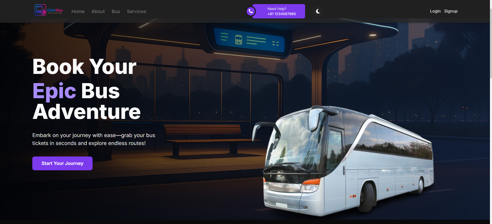

# GlideWay: The Ultimate Smart Bus Booking Platform

| GlideWay: Redefining Bus Travel |
|---------------------------------|
|  |

## 📑 Table of Contents
- [🌟 Introduction](#-introduction)
- [✨ Features](#-features)
  - [👥 Passenger Features](#-passenger-features)
  - [🧑‍✈️🚌 Driver Tools](#-driver-tools)
  - [🛡️ Admin Dashboard](#-admin-dashboard)
  - [🚀 Unique Functionalities](#-unique-functionalities)
- [📸 Screenshots](#-screenshots)
- [🚀 Getting Started](#-getting-started)
  - [Prerequisites](#prerequisites)
  - [Installation](#installation)
- [🛠️ Tech Stack](#-tech-stack)
  - [Frontend](#frontend)
  - [Backend](#backend)
- [📈 Future Enhancements](#-future-enhancements)
- [🙋‍♂️ About the Developer](#-about-the-developer)

---

## 🌟 Introduction

**GlideWay** is a cutting-edge full-stack bus booking platform designed to enhance the travel experience for passengers, drivers, and administrators. Developed by Diptadeep Sinha, a dedicated student from KIIT University, GlideWay tackles real-world travel challenges by fostering seamless communication, promoting social travel, and prioritizing passenger comfort. With role-based access for passengers, drivers, and admins, it offers a robust, user-friendly solution for modern bus travel.

> A smart travel platform enabling effortless booking, real-time tracking, group chats, and personalized travel experiences.

---

## ✨ Features

### 👥 Passenger Features
- **Search & Filter**: Find buses by source, destination, date, bus name, number, price, time, available seats, or bus type (AC, Non-AC, Seater, Sleeper, Primo, Volvo, Govt).
- **Detailed Bus Info**: View comprehensive bus details, including seat selection, amenity ratings, and overall bus ratings.
- **Social & Group Travel**: Opt for group bookings with discounts and join group chats for social travel.
- **Booking Management**: View booking history, cancel bookings, and receive email confirmations for bookings, cancellations, group invites, and delays.
- **Real-Time Interaction**: Chat with drivers or bus authorities and join group chats for social travel.
- **Live Tracking**: Access live bus tracking links to share with loved ones for safety.
- **Convenience**: Choose boarding points, print tickets, and rate amenities (WiFi, cleanliness, comfort) post-journey.

### 🧑‍✈️🚌  Driver Tools
- **Schedule Management**: Create and edit schedules with details like bus name, number, departure/arrival times, boarding points, halting points, and image uploads.
- **Trip Oversight**: View assigned trips, start/stop live tracking, and monitor passenger bookings.
- **Real-Time Communication**: Respond to passenger queries via real-time chat and report delays, notifying passengers through email and the booking page.
- **Performance Tracking**: Mark journeys as completed, log actual timings and earnings, and view performance metrics (trips completed, ratings, badges) in a dedicated dashboard.

### 🛡️ Admin Dashboard
- **System Management**: Oversee buses, drivers, routes, and schedules.
- **Analytics Dashboard**: Monitor active buses, bookings in the last 24 hours, daily revenue, live bus locations, and passenger details.
- **Maintenance & Insights**: Schedule bus maintenance and review journey/amenity ratings.
- **Data Visualization**: Access graphs for booking trends, revenue trends, bus type distribution, bus status, and amenity ratings.
- **Driver Performance**: Track driver metrics, including trips completed and ratings.

### 🚀 Unique Functionalities
- ✅ **Real-Time Communication**: Serves as a handy means of communication between bus authority and passengers.
- ✅ **Group Chats**: Enable co-passengers to connect via live group chats for social travel.
- ✅ **Delay Notifications**: Instant email and dashboard updates for delays.
- ✅ **Group Booking Discounts**: Smart fare splitting for group travelers.
- ✅ **Live Tracking Links**: Shareable links for real-time bus location tracking.
- ✅ **Amenity Feedback**: Rate WiFi, cleanliness, comfort, and more post-journey.

---

## 📸 Screenshots

<details>
<summary><b>🔽 Click to View Screenshots</b></summary>

### 🏠 Home Page
| Hero Banner | Search & Category | Offer |
|-------------|---------------|---------------|
|  |  | |

### 🎟️ Booking Flow
| Search Bus Page | Bus Details | Checkout | Booking Summary | Print Ticket |
|-------------|----------------|----------------------|----------------------|----------------|
|  |  |  |[Booking Summary](screenshots/bookingsummary.png) |[Print Ticket](screenshots/printticket.png) |

### 🗣️ Passenger Features
| Passenger Chat | Group Chat | Live Tracking | My Bookings |
|----------------|------------|---------------|---------------|
|  |  |  |  |

### 📊 Admin Dashboard
| Live Tracking | Bus List | Analytics | Driver Performance | Manage Bus | Manage Driver | Manage Route |
|--------------------|----------------|------------|------------|------------|------------|------------|
|  |  |  |  |  |  |  |

### 🧑‍✈️ Driver Dashboard
| Schedule Management | Edit Schedule | Assigned Trips | Driver Tracking | Performance Dashboard |
|---------------------|----------------------|----------------------|---------------------|----------------------|
|  |  |  |  |  |

### 📧 Email Notifications
| Booking Confirmation | Cancellation Notice | Delay Notification | Group Invite |
|----------------------|---------------------|---------------------|--------------|
|  |  |  |  |

</details>

---

## 🚀 Getting Started

### Prerequisites
- **Node.js** + **npm** (for frontend and backend)
- **Express.js** (for backend API framework, installed via npm)
- **MongoDB** (Atlas or local)
- **Cloudinary** (for image storage) or local file storage
- **Mapbox API Key** (for live tracking maps)

### Installation
#### 📁 Frontend
1. Navigate to the frontend directory:
   ```bash
   cd Frontend
2. Install dependencies:
    ```bash
    npm install
4.  Configure environment variables (e.g., API base URL, Mapbox API key) in a .env file:
    ```bash
    VITE_API_BASE_URL=http://localhost:5000/api
    VITE_MAPBOX_API_KEY=your_mapbox_api_key
6.  Start the development server  
    ```bash
    npm run dev

#### 📁 Backend Setup
1. Navigate to the backend directory:
   ```bash
   cd Backend
2. Install dependencies (including Express.js):
   ```bash
   npm install
3. Configure environment variables (e.g., MongoDB URI, Mapbox API key, Nodemailer credentials) in a .env file:
   ```bash
    MONGODB_URI=mongodb://localhost/glideway
    MAPBOX_API_KEY=your_mapbox_api_key
    NODEMAILER_EMAIL=your_email@example.com
    NODEMAILER_PASS=your_email_password
    JWT_SECRET=your_jwt_secret
    CLOUDINARY_URL=your_cloudinary_url
   
 4. Start the backend server:
    ```bash
    node server.js

## 🛠️ Tech Stack

### Frontend
[](https://reactjs.org/)
[](https://vitejs.dev/)
[](https://tailwindcss.com/)
[](https://www.framer.com/motion/)
[](https://react-icons.github.io/react-icons/)
[](https://reactdatepicker.com/)
[](https://react-hot-toast.com/)
[](https://reactrouter.com/)
[](https://react-leaflet.js.org/)
[](https://maplibre.org/)
[](https://recharts.org/)
[](https://www.chartjs.org/)
[](https://www.papaparse.com/)
[](https://axios-http.com/)
[](https://socket.io/)

### Backend
[](https://nodejs.org/)
[](https://expressjs.com/)
[](https://mongoosejs.com/)
[](https://jwt.io/)
[](https://www.npmjs.com/package/bcryptjs)
[](https://www.npmjs.com/package/multer)
[](https://www.npmjs.com/package/dotenv)
[](https://nodemailer.com/)
[](https://socket.io/)
[](https://www.mapbox.com/)
[](https://date-fns.org/)
    
## 📈 Future Enhancements
- **Multi-Language Support**: Implement localization to support diverse user bases and enhance accessibility.
- **Payment Gateway Integration**: Add secure online payment options for seamless booking transactions.
- **AI-Powered Recommendations**: Leverage user preferences and booking history to suggest personalized bus options.
- **Offline Mode**: Enable caching of critical data for access during travel with limited connectivity.
- **Driver Incentive System**: Enhance badge and reward mechanisms to motivate and recognize top-performing drivers.

## 🙋‍♂️ About the Developer
GlideWay was crafted by Diptadeep Sinha, driven by a vision to transform bus travel. With expertise in full-stack development, real-time systems, and user-centric design, this project embodies a commitment to addressing real-world travel challenges. Connect with me on [GitHub](https://github.com/Diptadeep-21) or [LinkedIn](https://linkedin.com/in/diptadeep-sinha-352365349/) to collaborate or share feedback!
 
